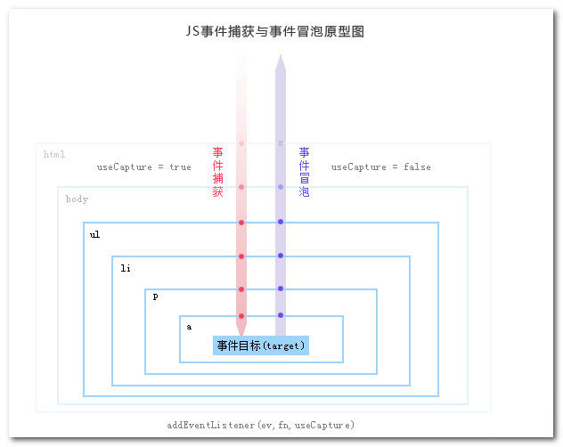

# DOM事件

## DOM级别与DOM事件

DOM级别：

- DOM0级
- DOM1级
- DOM2级
- DOM3级

DOM事件：

- DOM0级事件处理，
- DOM2级事件处理
- DOM3级事件处理

> 1级DOM标准中并没有定义事件相关的内容，所以没有所谓的1级DOM事件模型。

## 事件模型

- 冒泡型事件：当你使用事件冒泡时，子级元素先触发，父级元素后触发；
- 捕获型事件：当你使用事件捕获时，父级元素先触发，子级元素后触发；

> DOM事件流：同时支持两种事件模型：捕获型事件和冒泡型事件
>阻止冒泡：在W3c中，使用stopPropagation（）方法；在IE下设置cancelBubble = true
>阻止捕获：阻止事件的默认行为，例如click - \<a>后的跳转。在W3c中，使用preventDefault（）方法，在IE下设置window.event.returnValue = false  

### DOM 0级

```
<button type="button" onclick="showFn()"></button>

<script>
    function showFn() {
        alert('Hello World');
    }
</script>
```

上面是 HTML事件处理程序,太过强耦合性 为了改进 出现了DOM0级事件就是将一个函数赋值给一个事件处理属性，比如：

```
<button id="btn" type="button"></button>

<script>
    var btn = document.getElementById('btn');

    btn.onclick = function() {
        alert('Hello World');
    }

    // btn.onclick = null; 解绑事件
</script>
```


缺点 ： 一个处理程序无法同时绑定多个处理函数，比如我还想在按钮点击事件上加上另外一个函数

### DOM 2级事件

DOM2级事件在DOM0级事件的基础上弥补了一个处理程序无法同时绑定多个处理函数的缺点，允许给一个处理程序添加多个处理函数。

大多数情况下，都是将事件处理程序添加到事件流的冒泡阶段，这样可以最大限度地兼容各种浏览器。


```
<button id="btn" type="button"></button>

<script>
    var btn = document.getElementById('btn');

    function showFn() {
        alert('Hello World');
    }

    btn.addEventListener('click', showFn, false);

    // btn.removeEventListener('click', showFn, false); 解绑事件
</script>

```

DOM2级事件定义了addEventListener和removeEventListener两个方法，分别用来绑定和解绑事件，方法中包含3个参数，分别是绑定的事件处理属性名称（不包含on）、处理函数和是否在捕获时执行事件处理函数。如果我们还需要添加一个鼠标移入的方法，只需要：

```
btn.addEventListener('mouseover', showFn, false);
```

> 事件处理程序基于订阅发布模式设计

IE8级以下版本不支持addEventListener和removeEventListener，需要用attachEvent和detachEvent来实现,所以也就会出现通用事件监听器

__IE下的DOM2级事件异同__

相同

- 1、都可以添加和移除事件处理程序，匿名函数均不可移除。
- 2、都可以添加多个事件处理程序。

不同

- 1、IE的事件处理函数会在全局作用于执行，所以this指向window，而DOM方法中this指向元素对象引用
- 2、当添加多个事件处理程序时：执行的顺序和DOM2级事件处理程序相反。

### DOM3级事件

DOM3级事件在DOM2级基础上添加了很多类型：

- UI事件，当用户与页面上的元素交互时触发，如：load、scroll
- 焦点事件，当元素获得或失去焦点时触发，如：blur、focus
- 鼠标事件，当用户通过鼠标在页面执行操作时触发如：dbclick、mouseup
- 滚轮事件，当使用鼠标滚轮或类似设备时触发，如：mousewheel
- 文本事件，当在文档中输入文本时触发，如：textInput
- 键盘事件，当用户通过键盘在页面上执行操作时触发，如：keydown、keypress
- 合成事件，当为IME（输入法编辑器）输入字符时触发，如：compositionstart
- 变动事件，当底层DOM结构发生变化时触发，如：DOMsubtreeModified

## DOM事件流



- 捕获阶段：在事件冒泡的模型中，捕获阶段不会响应任何事件；
- 目标阶段：目标阶段就是指事件响应到触发事件的最底层元素上；
- 冒泡阶段：冒泡阶段就是事件的触发响应会从最底层目标一层层地向外到最外层（根节点），事件代理即是利用事件冒泡的机制把里层所需要响应的事件绑定到外层；


### 事件委托的优点

- 减少内存消耗

如果给每个列表项一一都绑定一个函数，那对于内存消耗是非常大的，效率上需要消耗很多性能；

因此，比较好的方法就是把这个点击事件绑定到他的父层，也就是 ul 上，然后在执行事件的时候再去匹配判断目标元素；

- 动态绑定事件

在很多时候，我们需要通过 AJAX 或者用户操作动态的增加或者去除列表项元素，那么在每一次改变的时候都需要重新给新增的元素绑定事件，给即将删去的元素解绑事件；
如果用了事件委托就没有这种麻烦了，因为事件是绑定在父层的，和目标元素的增减是没有关系的，执行到目标元素是在真正响应执行事件函数的过程中去匹配的；


### 事件冒泡

事件冒泡就是事件像泡泡一样从最开始生成的地方一层一层往上冒，一层一层向上直至最外层的html或document

好处：因为事件具有冒泡机制，因此我们可以利用冒泡的原理，把事件加到父级上，触发执行效果。这样做的好处当然就是提高性能了

自内而外

**阻止事件冒泡**

```
child.addEventListener('click', function(e) {
    alert('我是目标事件');
    e.stopPropagation();
}, false);
```

### 事件捕获

和事件冒泡相反，事件捕获是自上而下执行，我们只需要将addEventListener的第三个参数改为true就行

## Event 对象

Event对象其实是一个事件处理程序的参数，当调用事件时，我们只需要将其传入事件函数就可以获取。

```
function getEvent(event) {
    event = event || window.event;
}
```

> IE 下是window.event

- type (String) — 事件的名称
- target (node) — 事件起源的DOM节点
- currentTarget?(node) — 当前回调函数被触发的DOM节点（后面会做比较详细的介绍）
- bubbles (boolean) — 指明这个事件是否是一个冒泡事件（接下来会做解释）
- preventDefault(function) — 这个方法将阻止浏览器中用户代理对当前事件的相关默认行为被触发。比如阻止\<a>元素的click事件加载一个新的页面
- cancelable (boolean) — 这个变量指明这个事件的默认行为是否可以通过调用event.preventDefault来阻止。
- stopPropagation (function) — 取消事件的进一步捕获或冒泡，bubbles为true使用这个方法
- eventPhase：返回一个数字，表示事件目前所处的阶段，0为事件开始从DOM表层向目标元素传播，1为捕获阶段，2为事件到达目标元素，3为冒泡阶段。


### Event对象方法

Event对象主要有以下两个方法，用于处理事件的传播（冒泡、捕获）和事件的取消。

- stopPropagation
- preventDefault
- stopImmediatePropagation

stopPropagation方法主要用于阻止事件的进一步传播，比如阻止事件继续向上层冒泡。

```
function getEvent(event) {
    event.stopPropagation();
}

child.addEventListener('click', getEvent, false);

```

preventDefault方法用于取消事件的默认操作，比如a链接的跳转行为和表单自动提交行为就可以用preventDefault方法来取消。

```
<a id="go" href="https://www.baidu.com/">禁止跳转</a>
var go = document.getElementById('go');

function goFn(event) {
    event.preventDefault();

    console.log('我没有跳转！');
}

go.addEventListener('click', goFn, false);
```

stopImmediatePropagation同样可以阻止事件的传播，不同点在于其还可以把这个元素绑定的同类型事件也阻止了。

```
var go = document.getElementById('go');

function goFn(event) {
    event.preventDefault();
    event.stopImmediatePropagation(); // 阻止事件冒泡并阻止同类型事件

    console.log('我没有跳转！');
}

function goFn2(event) {
    console.log('我是同类型事件！');
}

go.addEventListener('click', goFn, false);
go.addEventListener('click', goFn2, false);
```

如果我们在goFn方法中添加了stopImmediatePropagation方法，那么goFn2方法将不会被执行，同时也不会将点击事件冒泡至上层

### Event对象属性

- type属性

通过type我们可以获取事件发生的类型，比如点击事件我们获取的是'click'字符串。

```
var go = document.getElementById('go');

function goFn(event) {
    console.log(event.type); // 输出'click'
}

go.addEventListener('click', goFn, false);
```

- target属性

target属性主要用于获取事件的目标对象，比如我们点击a标签获取的是a标签的html对象

```
var go = document.getElementById('go');

function goFn(event) {
    var target = event.target;
    //<a id="go" href="javascript:0">禁止跳转</a>
    console.log(target === go) // 返回true
}

go.addEventListener('click', goFn, false);
```

- 鼠标事件属性

在用鼠标触发事件时，主要的事件属性包含鼠标的位置和按键的状态，比如：clientX和clientY指定了鼠标在窗口坐标中的位置，button和which指定了按下的鼠标键是哪个。

```
function moveFn(event) {
    console.log(event.screenX) // 获取鼠标基于屏幕的X轴坐标
    console.log(event.screenY) // 获取鼠标基于屏幕的Y轴坐标
    console.log(event.clientX) // 获取鼠标基于浏览器窗口的X轴坐标
    console.log(event.clientY) // 获取鼠标基于浏览器窗口的Y轴坐标
    console.log(event.pageX) // 获取鼠标基于文档的X轴坐标
    console.log(event.pageY) // 获取鼠标基于文档的Y轴坐标
}

function clickFn(event) {
    console.log(event.button) // 获取鼠标按下的键。非IE浏览器中0为鼠标左键，1为鼠标中键，2为鼠标右键
    console.log(event.which) // 获取指定事件上哪个键盘键或鼠标按钮被按下
}

document.addEventListener('mouseover', moveFn, false);
document.addEventListener('click', clickFn, false);
```

- 键盘事件属性

在用键盘触发事件时，主要的事件属性包含键盘的按键keyCode和是否按下特殊键，比如：keyCode指定了按下键的键码值，ctrlKey指定是否按下了ctrl键。

```
function keyFn(event) {
    console.log(event.keyCode); // 获取按下键的键码值
    console.log(event.ctrlKey); // 获取是否按下了ctrl键
    console.log(event.shiftKey); // 获取是否按下了shift键
    console.log(event.altKey); // 获取是否按下了alt键
    console.log(event.metaKey); // 获取是否按下了meta键
}

document.addEventListener('keyup', keyFn, false);
```

### 部分具体时间

- 焦点事件
    - 1. blur：元素失去焦点时触发，该事件不冒泡
    - 2. focus：元素获得焦点时触发。不冒泡
    - 3. focusin：元素获得焦点时触发，冒泡
    - 4. focusout：元素失去焦点时触发，冒泡

- 鼠标事件
    - click：当用户点击鼠标主键通常是指鼠标左键或按回车键时触发。
    - dbclick：用户双击鼠标时触发
    - mousedown：当用户按下鼠标任意一个键都会触发，这个事件是不能够通过键盘触发的。
    - mousemove：当鼠标在某元素周围移动时重复触发，该事件不能通过键盘事件触发。
    - mouseout：当鼠标离开元素时触发，这个事件不能通过键盘触发。
    - mouseover：当鼠标进入元素时触发，这个事件不能够通过键盘触发。
    - mouseenter：类似“mouseover”，但不冒泡，而且当光标移到后代元素上不会触发。
    - mouseleave：类似“mouseout”，但不冒泡。在元素上方是不触发。
    - mouseup：当用户释放鼠标按键时触发，不能够通过键盘触发。


## JQ中的事件委托

- $.on: 基本用法: $('.parent').on('click', 'a', function () { console.log('click event on tag a'); })，它是 '.parent' 元素之下的 a 元素的事件代理到 $('.parent') 之上，只要在这个元素上有点击事件，就会自动寻找到 .parent 元素下的 a 元素，然后响应事件；
- $.delegate: 基本用法: $('.parent').delegate('a', 'click', function () { console.log('click event on tag a'); })，同上，并且还有相对应的 $.delegate 来删除代理的事件；
- $.live: 基本使用方法: $('a', $('.parent')).live('click', function () { console.log('click event on tag a'); })，同上，然而如果没有传入父层元素 $(.parent)，那事件会默认委托到 $(document) 上；(已废除)

